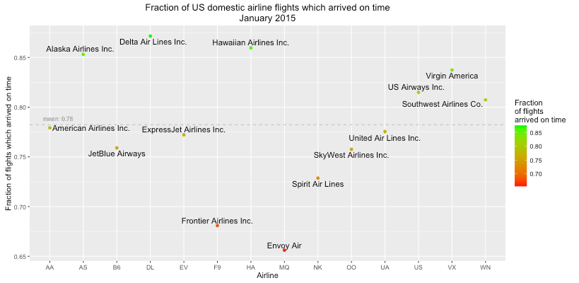
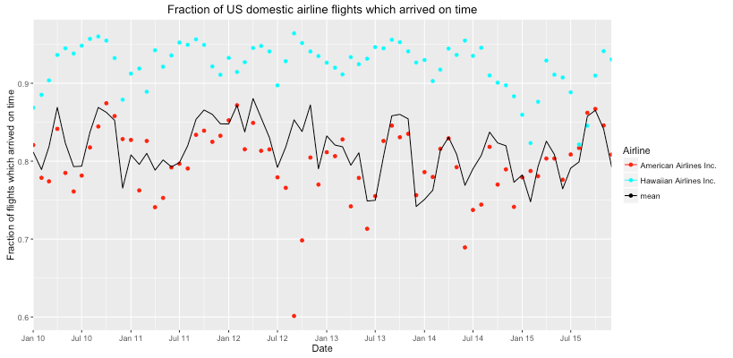
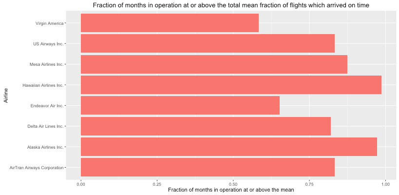

# Don't make me late

##Goal
Using the <a href="http://apps.bts.gov/xml/ontimesummarystatistics/src/index.xml">“Airline On-Time Statistics”</a> data from the “U.S. Department of Transportation Bureau of Transportation Statistics”:
**find the airline with whom there is the least chance of having a flight delayed.**

##Data
The “Airline On-Time Statistics” database tracks a range of departure and arrival statistics for “nonstop scheduled-service flights between points within the United States.” Here we focus on two variables, the **UniqueCarrier** and **ArrDel15** fields. **UniqueCarrier** id is, as the name suggests, a unique carrier id given to every airline operating within the US. The **ArrDel15** variable acts as a binary definition of lateness. If a plane arrives 15 minutes or more beyond its scheduled arrival time it is classified as being late. This makes it easy to compare lateness across the different airlines.

##Data Preprocessing 
Data for several years is scraped from <a href ="http://www.transtats.bts.gov/DL_SelectFields.asp?Table_ID=236&DB_Short_Name=On-Time">Department of Transportation Bureau of Transportation Statistics</a> using `data/get_data.py`, a modified version of <a href="https://github.com/isaacobezo/get_rita">github.com/isaacobezo/get_rita</a>, and pre-processed using `preprocess.R`.
This converts the **UniqueCarrier** id to a human readable airline name using the lookup table given by the <a href ="http://www.transtats.bts.gov/DL_SelectFields.asp?Table_ID=236&DB_Short_Name=On-Time">Department of Transportation Bureau of Transportation Statistics</a>. This lookup table is also included in the repo as `L_UNIQUE_CARRIERS.csv-`. Additionally a fraction on time variable is calculated for each airline for each month. For a given airline for a given month this is the fraction of the total number of flights which are not classified as delayed. These values are then saved to a `.csv` file to allow quick rendering of the data in the shiny app.

##Plots
The app can render three different plots.
### Fraction on time - monthly plot

### Fraction on time - timeline plot

### Fraction on time - airline comparison plot

